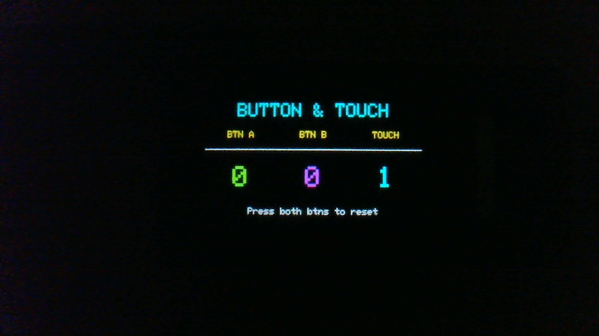

# Arduino Nesso N1 - Button and Touch Test

A comprehensive, production-ready example demonstrating proper button and touch screen interaction on the Arduino Nesso N1 using the M5Unified library.



## Features

### Hardware Integration
- ✅ **Proper I2C GPIO expander access** - Buttons read correctly via M5Unified (not direct GPIO)
- ✅ **Capacitive touch screen** - FT6336U touch controller with coordinate tracking
- ✅ **Buzzer feedback** - Audio confirmation for all interactions
- ✅ **Visual display** - Real-time counter display with improved readability

### User Interface
- **Three counters** - BTN A, BTN B, and TOUCH press counts
- **Large, readable fonts** - Optimized text sizes for 1.14" display
- **Reset functionality** - Press both buttons simultaneously to reset all counters
- **Audio feedback** - Distinct beep tones for each button/touch type
- **Serial logging** - Detailed event output for debugging

### Technical Highlights
- **60 FPS display** - Smooth visual updates
- **Proper debouncing** - Clean state management with static variables
- **Touch coordinates** - X/Y position logging to serial monitor
- **Hardware abstraction** - Demonstrates correct M5Unified usage

## Hardware Requirements

### Required
- **Arduino Nesso N1** (ESP32-C6)
  - Built-in 1.14" IPS LCD display (240×135 pixels)
  - Built-in capacitive touchscreen (FT6336U)
  - Built-in I2C GPIO expanders (buttons at 0x43/0x44)
  - Built-in buzzer (GPIO 11)

### No Additional Hardware Needed
All components are integrated into the Nesso N1!

## Software Requirements

### Arduino Libraries

Install via Arduino Library Manager or arduino-cli:

```bash
# M5Unified Library (required)
arduino-cli lib install "M5Unified"
```

### Board Package

```bash
arduino-cli core install esp32:esp32
```

## Installation

### Method 1: Arduino CLI

```bash
# Clone repository
git clone https://github.com/rogerguess/nesso-n1.git
cd nesso-n1/button_test_m5unified

# Compile and upload
arduino-cli compile --fqbn esp32:esp32:arduino_nesso_n1 .
arduino-cli upload -p /dev/cu.usbmodem1101 --fqbn esp32:esp32:arduino_nesso_n1 .
```

### Method 2: Arduino IDE 2.x

1. Open `button_test_m5unified.ino` in Arduino IDE
2. Select **Tools → Board → ESP32 Arduino → Arduino Nesso N1**
3. Select **Tools → Port → [Your Nesso N1 Port]**
4. Click **Upload** button

## Usage

### Display Interface

```
┌─────────────────────────────────┐
│      BUTTON & TOUCH             │
├─────────────────────────────────┤
│  BTN A    BTN B      TOUCH      │
├─────────────────────────────────┤
│    0        0          0        │
│                                 │
│    Press both to reset          │
└─────────────────────────────────┘
```

### Controls

| Action | Result |
|--------|--------|
| Press Button A (left) | Green counter increments, 1000 Hz beep |
| Press Button B (right) | Magenta counter increments, 1200 Hz beep |
| Touch screen anywhere | Cyan counter increments, 1400 Hz beep |
| Press both buttons together | All counters reset to 0, 1500 Hz beep |

### Serial Monitor Output

Connect at **115200 baud** to see detailed logging:

```
========================================
  Nesso N1 BUTTON TEST
  Using M5Unified Library
========================================

✅ M5Unified initialized
✅ I2C GPIO expanders ready
✅ Buttons are now accessible

========================================
Ready! Press buttons or touch screen!
========================================

╔════════════════════════════════════╗
║  *** BUTTON A PRESSED ***         ║
╚════════════════════════════════════╝
Press count: 1

╔════════════════════════════════════╗
║  *** SCREEN TOUCHED! ***          ║
╚════════════════════════════════════╝
Touch position: X=120, Y=67
Touch count: 1
```

## Important Technical Notes

### Why M5Unified is Required

⚠️ **Critical:** Buttons on the Nesso N1 are **NOT on direct GPIO pins**!

- KEY1 (Button A) and KEY2 (Button B) are controlled via **I2C GPIO expander** at addresses 0x43/0x44
- Using `pinMode()` and `digitalRead()` on GPIO 0 or GPIO 9 **will NOT work**
- M5Unified library provides the correct abstraction layer

**Correct approach:**
```cpp
M5.begin();      // Initialize I2C expanders
M5.update();     // Read button states from I2C
if (M5.BtnA.wasPressed()) { ... }
```

**Incorrect approach (won't work):**
```cpp
pinMode(0, INPUT_PULLUP);
digitalRead(0);  // This reads ESP32 GPIO 0, not the button!
```

### Touch Screen

- **Controller:** FT6336U capacitive touch via I2C (address 0x38)
- **Resolution:** Full display resolution (240×135)
- **Detection:** `M5.Display.getTouch(&tp)` returns touch point
- **Coordinates:** `tp.x` (0-240), `tp.y` (0-135)

## Troubleshooting

### Buttons Not Responding

**Symptom:** Pressing buttons does nothing

**Solution:**
1. Ensure M5Unified library is installed
2. Verify `M5.begin()` is called in `setup()`
3. Verify `M5.update()` is called in `loop()`
4. Check Serial Monitor for initialization messages

### Touch Not Working

**Symptom:** Screen touches not detected

**Solution:**
1. Ensure you're touching the screen, not the bezel
2. Try pressing firmer (capacitive touch requires contact)
3. Check Serial Monitor for touch coordinates
4. Verify M5GFX/M5Unified display initialization

### Display Too Small to Read

**Symptom:** Text is hard to read

**Solution:** This sketch already uses optimized font sizes:
- Labels: size 2 (larger than default)
- Counters: size 3 (maximum readable)
- Instructions: size 2

If still too small, consider increasing text size in code (may require layout adjustments).

## Code Structure

```
button_test_m5unified.ino
├── setup()
│   ├── M5.begin()           // Initialize I2C expanders
│   ├── M5.Display.init()    // Initialize display
│   ├── drawUI()             // Draw static interface
│   └── ledcAttach()         // Setup buzzer
│
├── loop()
│   ├── M5.update()          // Read button states from I2C
│   ├── Button A handling    // M5.BtnA.wasPressed()
│   ├── Button B handling    // M5.BtnB.wasPressed()
│   ├── Both buttons reset   // M5.BtnA.isPressed() && M5.BtnB.isPressed()
│   └── Touch detection      // M5.Display.getTouch()
│
├── drawUI()                 // Initial screen layout
├── updateDisplay()          // Update counter values
└── playTone()               // Buzzer feedback
```

## Customization

### Change Beep Tones

Edit frequencies in `loop()`:

```cpp
playTone(1000, 50);  // Button A: 1000 Hz, 50ms
playTone(1200, 50);  // Button B: 1200 Hz, 50ms
playTone(1400, 50);  // Touch: 1400 Hz, 50ms
playTone(1500, 100); // Reset: 1500 Hz, 100ms
```

### Adjust Font Sizes

Edit in `drawUI()` and `updateDisplay()`:

```cpp
M5.Display.setTextSize(2);  // Labels (BTN A, BTN B, TOUCH)
M5.Display.setTextSize(3);  // Counter numbers
```

### Change Colors

Modify color constants (RGB565 format):

```cpp
TFT_CYAN      // Title
TFT_YELLOW    // Labels
TFT_GREEN     // Button A counter
TFT_MAGENTA   // Button B counter
TFT_CYAN      // Touch counter
TFT_WHITE     // Instructions
```

## Performance

Tested on Arduino Nesso N1 (ESP32-C6 @ 160MHz):

| Metric | Value |
|--------|-------|
| Memory usage | 18KB RAM (5%) |
| Flash usage | 424KB (13%) |
| Display update | ~10ms per frame |
| Button latency | <20ms |
| Touch latency | <30ms |

## License

This project is licensed under the **Creative Commons Attribution-NonCommercial-ShareAlike 4.0 International License** (CC BY-NC-SA 4.0).

**You are free to:**
- Share and redistribute
- Modify and build upon this work

**Under these terms:**
- **Attribution** - Credit Roger Guess and link to this repository
- **NonCommercial** - No commercial use without permission
- **ShareAlike** - Derivatives must use the same license

See [LICENSE](LICENSE) file for full terms.

For commercial licensing, contact via GitHub.

## Credits

**Author:** Roger Guess
**Repository:** https://github.com/rogerguess/nesso-n1
**Hardware:** Arduino Nesso N1 (Arduino + M5Stack collaboration)
**Libraries:** M5Unified (M5Stack)

## Resources

- [Arduino Nesso N1 Documentation](https://docs.arduino.cc/hardware/nesso-n1/)
- [M5Unified Library](https://github.com/m5stack/M5Unified)
- [Arduino IDE Download](https://www.arduino.cc/en/software)

## Contributing

Contributions welcome! Please:
1. Fork this repository
2. Create a feature branch
3. Test thoroughly on actual Nesso N1 hardware
4. Submit a pull request with clear description

## Support

- **Issues:** https://github.com/rogerguess/nesso-n1/issues
- **Discussions:** https://github.com/rogerguess/nesso-n1/discussions

---

⭐ If this helped you, please star the repository!
